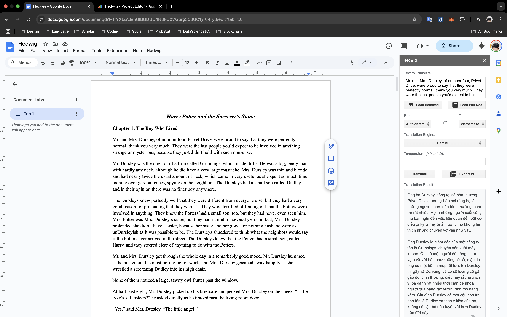
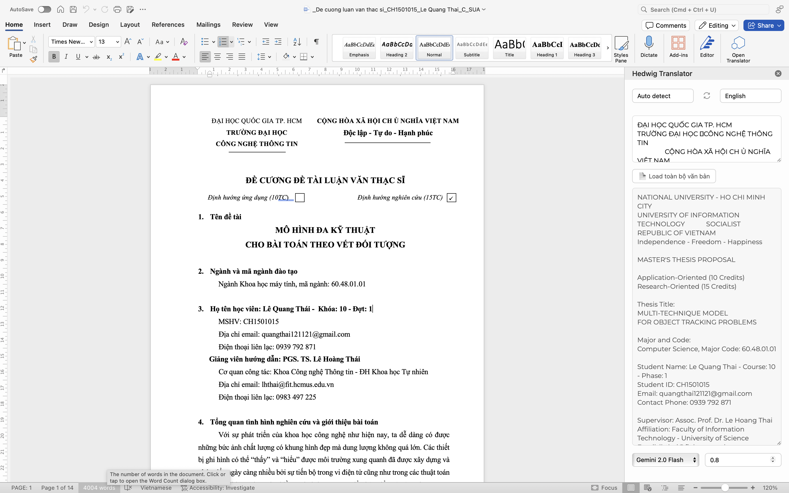
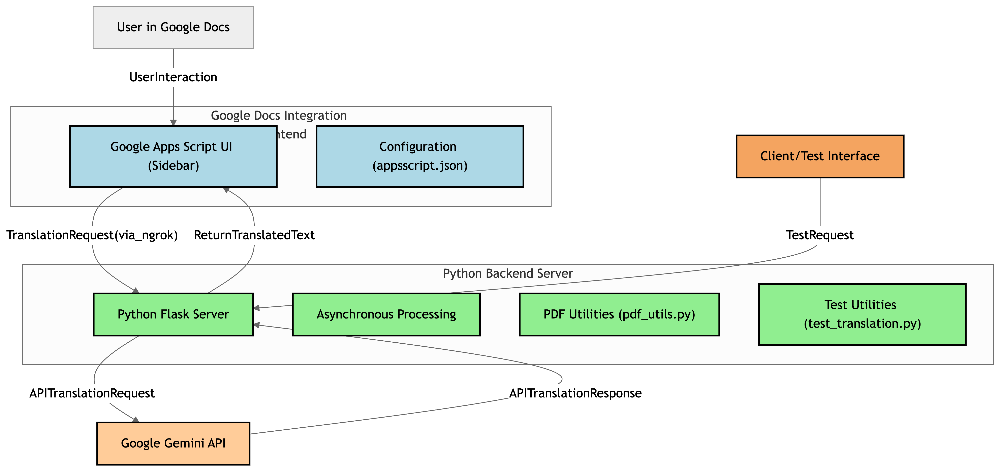

# Hedwig Translation Plugin

**Hedwig** is a powerful AI-powered translation plugin designed to work seamlessly within popular word processing platforms like **Google Docs** and **Microsoft Word**. This project enables effortless document translation by leveraging cutting-edge Large Language Models (LLMs) such as **Google’s Gemini**, directly inside your document.

> This project was developed as part of the **Natural Language Processing Applications (CSC15008)** course.

---

## Key Features

- **Text Translation:** Translate selected text or entire documents effortlessly.
- **Multilingual Support:**
  - Automatically detect source language.
  - Select both source and **target languages** from popular options (English, Vietnamese, Spanish, French, German, Chinese, Japanese, Korean, Russian, Hindi, Arabic, etc.).
  - Supports bi-directional translations.
- **AI Model Selection:**
  - Currently uses **Gemini** as the primary translation engine.
  - Placeholder for integrating other models like GPT-4 in the future.
- **Temperature Control:** Adjust the `temperature` parameter to manage translation creativity and accuracy.
- **Sidebar UI:** User-friendly integration directly into Google Docs and Microsoft Word sidebar.
- **Utilities:**
  - **Load Selected Text** and **Load Full Document** for quick input.
  - **Swap Languages** quickly switches the translation direction.
  - **Copy** translated text to clipboard.
- **Long Text Handling:** Backend efficiently splits and asynchronously translates long texts, minimizing errors and optimizing performance.
- **PDF Export (Coming Soon):** Functionality to export documents and translations to PDF is in development.

  

  
---

## Architecture Diagram



## Supported Platforms

- **Currently:**
  - Google Docs (via Google Apps Script Add-on)
  - Microsoft Word (via Office Add-in built with Webpack and Flask backend)
- **Future Plans:** LibreOffice Writer

---

## Technology Stack

- **Frontend:**
  - Google Docs: Google Apps Script (HTML, CSS, JavaScript)
  - Microsoft Word: Office.js + Webpack + JQuery
- **Backend:** Python 3, Flask, aiohttp, asyncio
- **Translation API:** Google Gemini API
- **Backend Libraries:**
  - `Flask-Cors`, `python-dotenv`, `requests`, `langdetect`, `fpdf2`, `aiohttp`, `Flask[async]`
- **Development Tunneling:** ngrok

---

## Installation & Development

### Prerequisites

- Google Account
- Python 3.8+ and pip
- Node.js and npm (for Word Add-in)
- ngrok CLI
- Google Cloud with Gemini API enabled

### Backend Setup (Shared)

```bash
git clone <your-repo-url>
cd hedwig-translation-plugin

# Setup virtual environment
python -m venv venv
source venv/bin/activate  # Windows: .\venv\Scripts\activate

# Install dependencies
pip install -r requirements.txt

# Run backend
python server/app.py
```

### ngrok Setup

```bash
ngrok http 5050
# Copy the HTTPS URL and update frontend configs
```

### Google Docs Add-in Setup

- Open Google Docs > `Extensions` > `Apps Script`
- Paste contents of `appsscript/Code.gs`, `Sidebar.html`, and `appsscript.json`
- Update `NGROK_BASE_URL` in `Code.gs`
- Deploy and test directly inside Google Docs

### Microsoft Word Add-in Setup

```bash
cd hedwig-word
npm install
npm start
```

- Trust the SSL certificate if prompted
- Word will open and sideload the add-in automatically

---

## Demo


---

## Project Structure

```
hedwig-translation-plugin/
│
├── appsscript/
│   ├── appsscript.json
│   ├── Code.gs
│   └── Sidebar.html
│
├── hedwig-word/
│   ├── manifest.xml
│   ├── package.json
│   ├── webpack.config.js
│   ├── .eslintrc.json
│   ├── babel.config.json
│   ├── src/
│   │   ├── taskpane/
│   │   ├── commands/
│   │   ├── config/
│   │   ├── constants/
│   │   └── utils/
│   └── assets/
│
├── demo/
│
├── server/
│   ├── app.py
│   ├── pdf_utils.py
│   ├── test_translation.py
│   └── .env
│
├── .gitignore
├── LICENSE
├── README.md
└── requirements.txt
```

---

## Contributing

This project is open to contributions. Please feel free to submit a PR.

## 📃 License

This project is provided under an MIT license. See the [LICENSE](LICENSE) file for details.
